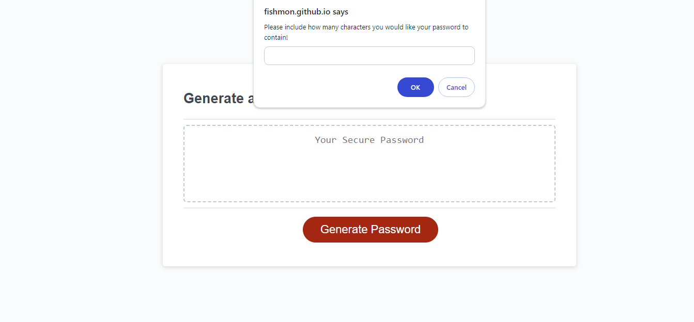

# Random Password Generator

# Purpose
A password generator is a tool that generates a random combination of numbers, letters, and symbols to be used as a password. Password generators let you exclude or include certain characters, allowing you to customize the password complexity to your needs. 

Password generators are a fast and convenient way to generate secure passwords. Password managers typically include built-in password generators so you can create a secure password on the fly when signing up for a new account (or updating an old one). 

Some password generators allow you to create passphrases, which are passwords that use words instead of fully random characters. Passphrases are easier to remember while still being very secure, assuming they're long enough. 

## Why should I Use a Password Generator?
The most common way for cybercriminals to hack accounts is guessing the password. They use programs that can try hundreds of passwords per second. Simple, common passwords are breached almost instantly.

One part of the solution is to use strong passwords to protect your information (you should also enable MFA). Password generators help you create strong passwords with a click and store them in a password manager. 
* The rng password generator i have created creates a unique password using numbers, uppercase and lowercase letters and special characters.
# Usage
1. Open the password generator URL in your browser.
2. Generate a random password by clicking the "Generate Password" button and following the prompts.
3. If you insert letters in prompts, it will give an error message and exit.
4. Choose a number of characters from 8 to 120.
5. If you don't chose any type of characters, you will get an error message, and the aplication will exit.

# Built With
* HTML
* CSS
* JavaScript

# Credits
# Created by [Serbanescu Claudiu](https://github.com/fishmon)

# [Deployed application](https://fishmon.github.io/GeneratePassword/)
# [Repository here](https://github.com/fishmon/GeneratePassword)

